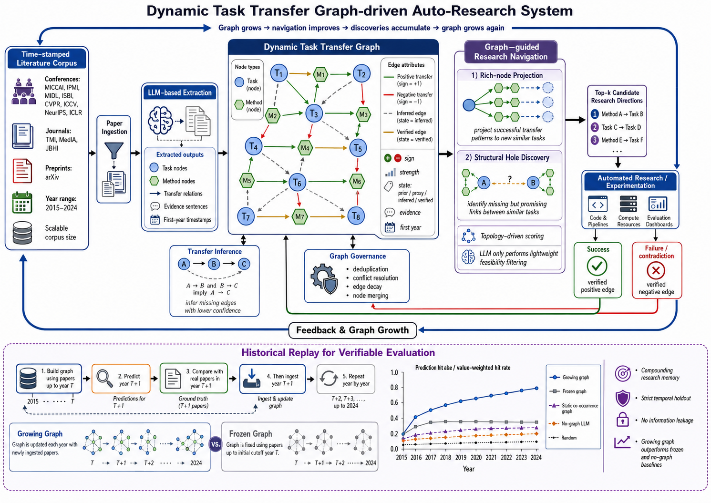

# A Living Task-Transfer Map for Compounding Auto-Research
### Project Proposal (for collaborators) · 项目提案(合作者沟通版)

> **One-line thesis / 一句话主张.** Build a *living* "who-helps-whom" task-transfer graph that **grows as exploration proceeds** and, in turn, **navigates exploration toward the next most valuable research direction** — turning auto-research from a memoryless, re-start-every-round process into a **compounding** one.
>
> **中文主张.** 构建一张**动态生长的"任务互助迁移图"(who-helps-whom)**:该图随研究探索持续生长,并反过来引导系统选择下一个最具价值的研究方向,从而将"每轮从零重启、缺乏记忆"的自动研究转变为**具有复利效应**的过程。

---

## 1. TL;DR

- **Problem.** Current auto-research / idea-generation systems do not *accumulate*. Each round re-ingests papers and re-prompts an LLM from scratch; discovered relationships ("approach A turns out to help task B") are never retained. Exploration is **flat, not compounding**.
- **Idea.** A directed, signed **task-transfer graph** (nodes = tasks/methods; edges = "A helps/hurts B") that is **continuously grown** by folding exploration results back in, and that **drives navigation** of where to explore next.
- **Why it can win.** We are the first to make the research graph **dynamic + self-navigating**. Closest systems are either static read-only (Intern-Atlas), fixed-substrate (Deep Ideation), or graph-less diversity search (AC/DC).
- **Why it is credible (not circular).** We validate against **external ground truth from real history**: (i) edges vs. *measured* transfer numbers reported in papers; (ii) navigation vs. *what the field actually did next* (temporal hold-out). The headline evidence is a **compounding curve** that a **growing** graph produces but a **frozen** graph cannot.
- **Training-free.** The LLM is never fine-tuned; intelligence accumulates in the **graph (external memory)**, not in weights. Corpus scope is a **tunable parameter** (a few thousand → millions of papers, same pipeline).

**中文摘要.** 现有自动研究系统的核心缺陷在于探索成果无法累积。本方案以动态生长的任务迁移图与复利闭环加以解决:其优势在于图能够动态演化并自主导航探索方向;其可信性源于以真实历史作为外部真值进行验证,主要证据为"生长图 vs. 冻结图"的复利曲线。系统全程无需训练,语料规模为可调参数。

---



**Figure 1. System overview.** Time-stamped corpus → LLM extraction of **task** and **method** nodes with signed transfer edges → transitive inference → **graph-guided navigation** (rich-node projection + structural-hole discovery; *topology-driven scoring, with the LLM restricted to lightweight feasibility filtering*) → auto-research → results fold back as **verified positive/negative edges** → governance → continuous ingest. **Bottom:** *Historical Replay* evaluation — build graph ≤ T, **predict T+1, compare to real T+1 papers, and only then ingest T+1** (strict temporal hold-out), repeating year by year; a **Growing** graph is compared against a **Frozen** one and against no-graph / co-occurrence / random baselines.
*The hit-rate curve is **illustrative of the expected trend**, not measured results. "No leakage" refers to corpus-level hold-out; residual LLM-pretraining leakage is **controlled and quantified by the no-graph-LLM baseline** (§7.4), not eliminated.*

**中文说明.** 图中折线为**预期趋势示意**,并非真实实验数据;"无信息泄漏"仅指语料层面的时序留出,大模型预训练权重中残余的泄漏由 no-graph 基线**加以度量并扣除**,而非完全消除。

---

## 2. Motivation & Problem / 动机与问题

Auto-research pipelines (idea generation, autonomous experimentation) treat each query independently. They can broadcast many ideas but **do not get smarter across rounds**: the structure they uncover (which directions transfer to which) evaporates. This is the gap we target — **persistent, structured, self-improving research memory that also decides where to look next.**

The key unmet need is not *scale of reading* (Intern-Atlas already reads ~1M papers) nor *retrieval speed* (HNSW/GraphRAG are mature). It is a **living relational structure that compounds**: each exploration both *uses* and *improves* the map.

**中文说明.** 关键的未满足需求并非"阅读规模"(Intern-Atlas 已达百万级)或"检索速度"(相关技术已成熟),而是一种**具备复利效应的动态关系结构**——每一次探索既利用该图,又改进该图。

---

## 3. Core Idea / 核心思想

A map where:
- **Each node = a research task / direction / method** (e.g., "contrastive pretraining for brain-MRI segmentation").
- **Each edge = a directed, signed transfer relation A→B**: does mastering A *help* (positive transfer), *hurt* (negative transfer), or not affect B?

Unlike a citation graph (Intern-Atlas: method-evolution edges) or a co-occurrence graph (Deep Ideation), our edge encodes **where knowledge can flow** — the question a researcher actually asks: *"Given what I can do, which new direction is most likely to pay off?"*

**The flywheel / 复利闭环:**
```
read graph → navigate to a "rich" node / structural hole
→ incubate the next direction (auto-research)
→ fold result back as new node/edges (graph grows & self-corrects)
→ govern (keep it clean) → read graph …
```
Bigger, truer graph → smarter navigation → more valuable discoveries → bigger graph. **This compounding IS the thesis.**

---

## 4. Positioning vs. Related Work / 定位

| System | Has graph? | Graph grows? | Graph navigates exploration? | Edge semantics |
|---|---|---|---|---|
| **Intern-Atlas** (2604.28158) | ✅ ~1M papers / 9.4M edges | ❌ static, read-only, no result feedback | ❌ | method evolution (extends/improves) |
| **Deep Ideation** (2511.02238) | ✅ concept co-occurrence | ❌ underlying graph fixed | partial | keyword co-occurrence |
| **AC/DC** (2604.14969) | ❌ no relational graph | — | ❌ diversity/novelty broadcast | n/a (discovers *LLM experts* via model merging) |
| **Ours** | ✅ | ✅ **living, results fold back** | ✅ **structure-directed** | **task transfer (directed, signed)** |

> **Note on AC/DC / 关于 AC/DC 的说明.** AC/DC is an *LLM-expert-discovery* framework (model merging + synthetic-task coevolution), **not** an idea-generation competitor. We cite it as an **open-endedness paradigm reference** (diversity-driven discovery), and use a diversity-navigation variant as a **baseline**, not as the same-task rival.

**Clean delta vs. Deep Ideation / 与最接近工作的核心区别.** Deep Ideation's *Idea Stack* accumulates a *linear history*; our contribution is folding results into a **structured transfer graph** where **transitivity** lets one new edge update estimates for *many* unexplored directions — compounding the Idea Stack cannot give.

---

## 5. Framework / 框架

### 5.1 Graph data model / 数据模型

**Node** `{ id, text, type(task|method), domain, method_summary, embedding, first_year, paper_refs, aliases, freq }`

**Edge A→B** `{ sign(±1/0), strength[0,1], transfer_value, state, confidence, contradicts_prior, evidence(paper, span), first_year, access_count, last_used }`

- `state ∈ {prior, proxy, inferred, verified}` — credibility tier: LLM-guessed → geometry-backed → transitivity-inferred → measured/really-run.
- **`first_year` on both nodes and edges is the linchpin** of temporal validation. 〔节点与边上的 `first_year` 是时序验证的关键字段〕
- `evidence` makes every edge traceable (anti-hallucination, à la Intern-Atlas).

### 5.2 Pipeline (8 stages) / 八步流程

| # | Stage | In → Out |
|---|---|---|
| 0 | **Scope (only human input)** | venue/year/sample-size parameter → timestamped paper stream 〔唯一需人工设定的可调参数〕 |
| 1 | **Bulk ingest** | papers ≤T, full or random sample (no cherry-picking; tasks emerge bottom-up) |
| 2 | **Extraction** | LLM reads each paper → task nodes + signed transfer edges + evidence; entity-resolve nodes → initial graph G₀ |
| 3 | **Transitive inference** | A→B, B→C ⇒ A→C (`inferred`, low conf) — extract the skeleton, infer the rest |
| 4 | **Navigation (NON-random, core)** | graph → ranked "next directions" |
| 5 | **Explore + fold-back (growth)** | direction → auto-research → result (success/contradiction) folded back as new edges |
| 6 | **Governance** | dedup / conflict-resolution / decay / deprecate — keep graph clean |
| 7 | **Continuous ingest (living)** | new papers added incrementally, no full re-read 〔现有对比系统不具备此能力〕 |
| 8 | **Evaluation harness** | inject external truth, score the system (see §7) |

### 5.3 Navigation — the heart / 导航(核心机制)

A "direction" = a **plausible edge that does not yet exist** but is implied by structure:
- **(a) Rich-node projection.** A node with many positive out-edges (a "rich vein") is projected onto similar, not-yet-connected targets.
- **(b) Structural holes.** High-similarity / high-shared-neighbor task pairs that lack an edge ("should-be-connected-but-isn't").
- **Scoring is graph-topological** (out-degree, similarity, path strength, transitive support). The **LLM is constrained**: it only does light, *local*, future-knowledge-free filtering ("is this learnable/interesting?"), never free-form generation of the answer.

> **Why constrain the LLM? / 为何限制大模型的作用.** A modern LLM has *already read* future papers during pretraining. If navigation relied on the LLM's free generation, "predicting" a 2023 direction from a 2020 graph could be **memory, not navigation**. Keeping the decision graph-driven makes any hit **attributable to the graph**. See §7.4.

### 5.4 Growth & governance / 生长与治理

- **Fold-back:** success → `verified` positive edge; failure/contradiction → negative edge + `contradicts_prior` flag (a negative result is equally valuable — it stops the navigator from going there and calibrates priors).
- **Governance** (mature engineering; cf. Mem0/MemOS/FadeMem/SSGM): merge aliases, resolve conflicting edges via self-edit (not append), decay & deprecate low-confidence, long-unused edges.
- 〔需注意的权衡〕在发现型图谱中,"长期未被访问"并不等于"错误":衰减机制不应误删尚未被充分探索的潜在机会。因此对高 `confidence`/`verified` 的边,衰减策略将设置得更为保守。

---

## 6. Key Innovations / 关键创新

1. **Living graph** — results fold back, graph grows; no competitor does this.
2. **Structure-directed navigation** — exploration steered by graph topology, not diversity broadcast.
3. **History-as-label evaluation** — converts open-ended ideation into a **falsifiable forecasting task** with free, objective labels; a method only a *growing temporal* graph can even set up.

---

## 7. Validation Plan / 验证方案 (the make-or-break)

**Principle:** never let the system grade its own homework. Truth comes from **real history**, external and pre-existing. 〔以真实历史作为标签,从而避免循环论证〕

### 7.1 Three verifiers — do not conflate / 三类验证者(不可混淆)

| | Role | Ground truth |
|---|---|---|
| **Stage 5 (fold-back)** | NOT a verifier — the in-loop **growth/teacher** mechanism (the thing being judged) | auto-research result (real run) / in validation: that year's real papers |
| **V-A: edge quality** | JUDGE of whether edges are correct | *measured* transfer deltas reported in papers |
| **V-B: navigation/compounding** | JUDGE of the main thesis | *what the field actually did next* |

### 7.2 V-A — Are the edges true? / 边的正确性验证
Harvest a **measured transfer matrix M\*** from papers reporting "pretrain on A → finetune on B → +x%". Compare the system's `prior`/`inferred` edges against M\* (sign accuracy / precision / recall). **Anti-leakage:** hold out the measurement papers so the edge is *predicted*, not *looked up*.

### 7.3 V-B — Does navigation predict value? + Compounding / 复利曲线
**The year-by-year temporal loop** (history replaces expensive auto-research):

```
G ← build_initial_graph(corpus ≤ T0)
for year Y in T0+1 … T_end:
    pred  ← navigate(G, k)                  # predict using graph that has NOT seen Y
    truth ← real edges/directions in year Y
    hit[Y] ← hit_rate(pred, truth)          # SCORE FIRST  (V-B judge)
    G.ingest(papers of year Y); govern(G)   # THEN GROW    (stage-5 teacher)
```
- **Compounding curve = hit[Y] over years.** Rising ⇒ the graph gets smarter as it grows.
- **Make-or-break ablation — Growing vs Frozen:** run a parallel **Frozen** arm that never folds back (always predicts from G_{T0}). **Growing pulling away from Frozen = compounding, measured.**
- **Strict order (anti-leakage):** SCORE year Y *before* ingesting Y. Reversing it invalidates the experiment.
- **"Value" via real signals:** weight hits by citations / follow-up papers / top-venue acceptance — not LLM opinion.

### 7.4 Baselines & leakage control / 基线与泄漏控制
On the same temporal-forecast task:
- **`no-graph LLM`** — ask the LLM directly for next directions. **This doubles as the leakage yardstick:** it quantifies how much the LLM's *memorized future* alone predicts. Our system must **significantly beat it**, so the delta is attributable to the graph (LLM memory held constant across arms). 〔即将大模型自身记忆作为常量予以扣除〕
- **`static co-occurrence graph`** (Deep Ideation analog), **`diversity navigation`** (AC/DC-spirit), **`random`** (lower bound).

### 7.5 Metrics / 指标
- V-A: sign-accuracy, precision/recall of edges vs M\*.
- V-B: hit@k (value-weighted) vs year; **slope** of compounding curve; Growing − Frozen gap; margin over `no-graph LLM`.
- Efficiency: high-value directions discovered per unit LLM/compute.

### 7.6 Optional live demo / 真实系统演示
On the top predicted directions, **actually run auto-research once** as qualitative evidence the loop is deployable. (The compounding curve does **not** depend on this.)

---

## 8. Risks & Mitigations / 风险与应对

| Risk | Mitigation |
|---|---|
| **LLM pretraining leakage** (model "knows" the future) | structure-driven navigation (§5.3) + `no-graph LLM` baseline as leakage yardstick (§7.4); optionally time-frozen models |
| **Circularity** (LLM judges itself) | external ground truth only (measured transfer + real history); growing-vs-frozen |
| **Hit-rate rewards only what happened** (mainstream bias; good-but-unpursued = "miss") | recall-oriented framing + citation/value weighting; state as a lower bound |
| **Navigation collapse** (endless drilling into rich veins) | novelty/interestingness quota forces a fraction of divergent exploration |
| **Distance to Deep Ideation** | hammer the three deltas: living + structure-directed + temporal eval; lead the intro with transitive-reuse vs linear Idea-Stack |
| **Graph dirtiness at scale** | governance suite (dedup/conflict/decay/deprecate), conservative on verified edges |

---

## 9. Work Plan, Milestones & Division of Labor / 分工与里程碑

**Suggested workstreams (assignable to collaborators):**

- **WS1 — Corpus & extraction (Stages 0–2).** Crawl scoped venues with timestamps; LLM extraction of task nodes + signed edges + evidence; entity resolution. *Deliverable: G₀ + extraction quality report.*
- **WS2 — Graph engine (Stages 3, 6, 7).** Transitive inference, governance (dedup/conflict/decay), incremental ingest; graph DB + embedding index. *Deliverable: living-graph service.*
- **WS3 — Navigation (Stage 4).** Rich-node projection, structural holes, topological scoring, constrained-LLM filter. *Deliverable: `navigate()` + ablation hooks.*
- **WS4 — Ground truth & evaluation (Stage 8).** Mine measured-transfer matrix M\* (V-A); temporal harness, growing/frozen, baselines, leakage control, value weighting (V-B). *Deliverable: the compounding-curve experiment.*
- **WS5 — Live auto-research demo (optional).** Plug one auto-research backend into fold-back for the qualitative demo.

**Milestones / 里程碑:**
1. **M1 — Pilot graph + temporal harness on a narrow sub-domain** (e.g., brain/retina): prove the *compounding curve trends positive*. 〔最高优先级:先在小规模上确认复利曲线呈上升趋势,此为项目成败的关键〕
2. **M2 — Growing-vs-frozen + baselines** complete; leakage control verified (beat `no-graph LLM`).
3. **M3 — Edge-quality validation (V-A)** vs measured transfer matrix.
4. **M4 — Scale up corpus** (turn the scope knob), governance hardened.
5. **M5 — Optional live auto-research demo; paper writing.**

> **Why pilot first / 为何先做试点.** The single biggest experimental risk is whether the compounding curve is *actually* positive. Validate the *trend* small before scaling — do not build full-domain first.

---

## 10. Decisions to Confirm Together / 待共同确认

1. **Node granularity:** task-only vs task+method (recommend **both**, via `type`).
2. **V-A ground truth:** mine paper-reported deltas / use existing benchmarks (MedMNIST, nnU-Net cross-task) / **both** (recommended).
3. **Leakage strategy:** time-frozen LLM vs **structure-driven + no-graph baseline** (recommended).
4. **First corpus scope:** focused sub-domain (brain/retina) vs full medical imaging (recommend **focused first**, scale later).

---

## 11. References / 文献

*(All arXiv IDs verified 2026-05.)*

- **Edge semantics / transfer:** TaskWeb (2305.13256) — pairwise transfer + transitivity; TaskShop improves source **ranking +10% / top-k precision +38%**. Vu et al. (2005.00770) — task embeddings predict transferability; gains largest when target data scarce.
- **Large-graph extraction:** Intern-Atlas (2604.28158) — LLM extraction at ~1M-paper scale, training-free, evidence-grounded edges.
- **Navigation / open-endedness:** OMNI (2306.01711) — foundation model as model-of-interestingness. AC/DC (2604.14969) — open-ended LLM-expert discovery (paradigm reference / baseline). ACD (2502.07577) — automated capability discovery, human-survey validated.
- **Growth / closed loop:** SkillGraph (2605.12039) — insert/merge/split/deprecate operators, graph–policy co-evolution. AI-Supervisor (2603.24402) — persistent Research World Model, consensus before commit.
- **Governance:** MemOS (2507.03724); Mem0 (2504.19413) — self-edit over append, p95 latency −91% / tokens −90%; FadeMem (2601.18642) — adaptive decay, storage −45%; SSGM (2603.11768) — hallucination vs temporal obsolescence, evidence-gated updates.
- **Retrieval:** Microsoft GraphRAG (Edge et al., 2024) — Leiden community hierarchy; LazyGraphRAG (2025) — indexing at 0.1% of GraphRAG cost; HNSW (Malkov & Yashunin) — million-scale ANN.
- **Idea-generation rivals:** Intern-Atlas; Deep Ideation (2511.02238) — review-trained critic, idea quality **+10.67%**, "surpassing top-conference acceptance"; SciAgents (2409.05556).

---

## Appendix A — System Pseudocode & Flow / 附录 A:系统流程伪代码

> 语料范围是系统唯一的人工输入参数;从数千篇到数百万篇均采用同一套流程,仅调节该参数的规模,处理逻辑不变。

### A.0 可调参数

```
语料范围 = {
    会议: [MICCAI, IPMI, MIDL, ISBI, CVPR, ICCV, NeurIPS, ICLR],
    期刊: [TMI, MedIA, JBHI],
    预印本: [arXiv.cs.CV, arXiv.eess.IV],
    年份: 2015–2024,
    采样规模: 全量      # 可设为数千 / 数万 / 全量 / 百万级;同一套代码
}
```
→ 唯一需人工设定的参数,决定图的规模,不改变任何处理逻辑。

### A.1 论文读入

```
函数 读入论文(语料范围):
    论文流 = 抓取(语料范围)        # 范围内全部论文,均带发表时间
    返回 论文流
```
→ **输入**:语料范围参数。**输出**:带时间戳的论文集合(不做人工筛选)。

### A.2 抽取:论文 → 节点与边

```
函数 抽取(论文, 图):
    任务列表 = 大模型_抽取任务(论文)         # 自下而上识别该文涉及的任务
    对 每个 任务 t:
        在图中 查找或新建节点(t)            # 同义任务合并,避免重复建点

    关系列表 = 大模型_抽取迁移关系(论文)      # 形如"以 A 预训练提升 B 5%"的陈述
    对 每条 (A, B, 符号, 强度, 是否经实测, 出处):
        新建边 A→B
        边.状态 = "已验证" 若经实测 否则 "先验"
        边.出处 = (论文, 原句)
        将边加入图
```
→ **输入**:单篇论文。**输出**:向图中新增若干节点与边。`已验证`表示论文经实验测得,`先验`表示由大模型依据语义推断。

### A.3 传递推断

```
函数 传递推断(图):
    对 图中每个节点 A:
        对 A 正向连接的每个 B:
            对 B 正向连接的每个 C:
                若 A 与 C 间尚无边:
                    新建边 A→C, 状态="推断", 置信度=低
```
→ **输入**:含骨架边的图。**输出**:补全大量未经直接验证、但由结构隐含的边,避免对数万任务对逐一实测。

### A.4 导航(非随机,核心)

```
函数 导航(图, 方向数 k):
    候选 = []

    # (a) 富节点投影:正向出边众多的节点,投影至与其已连目标相似、但尚未连接的任务
    对 图中每个节点 M:
        若 M 的正向出边数 ≥ 阈值:
            对 与"M 已连目标"相似的每个任务 T:
                若 M 尚未连接 T:
                    候选.加入( 方向(M→T, 依据="富节点投影") )

    # (b) 结构空洞:高度相似/共享邻居众多、却尚未连接的任务对
    对 每对高相似任务 (A, B):
        若 A、B 间无边 且 共享邻居数充足:
            候选.加入( 方向(A→B, 依据="结构空洞") )

    # 评分主要基于图拓扑(贡献归于图结构,不依赖大模型记忆 → 防止信息泄漏)
    对 每个候选: 候选.分数 = 拓扑评分(候选, 图)

    # 大模型仅做受限的局部判断(是否可学、是否有价值),不允许其自由生成方向
    候选 = 过滤(候选, 保留可学且有价值者)

    返回 分数最高的 k 个候选
```
→ **输入**:当前图。**输出**:排序后的候选方向列表(每个方向本质为图中尚不存在、但由结构看好的一条潜在新边)。该步骤严格非随机,是系统的核心。

### A.5 探索与回流(真实系统)

```
函数 真实系统主循环(图):
    循环:
        方向列表 = 导航(图, k)
        对 每个 方向 d:
            结果 = 自动研究(d)             # 端到端实验(成本较高)
            回流(图, d, 结果)
        治理(图)
        增量读入(图, 新到论文)             # 不重读全图

函数 回流(图, d, 结果):
    若 结果成功: 新增 已验证的正边 d
    否则:        新增 已验证的负边 d(负迁移,同样有价值;并标记"与先验矛盾")
```
→ **输入**:导航选出的方向。**输出**:将探索结果(无论成败)写回图,使图增长并自我修正,随后返回导航,形成闭环。

### A.6 治理

```
函数 治理(图):
    去重(图)         # 同一任务的不同表述 → 合并为单一节点
    冲突消解(图)     # 同一任务对出现正负矛盾 → 裁决并改写(而非简单堆叠)
    衰减与废弃(图)   # 长期未使用且低置信的边 → 退役,不再参与检索
```
→ **输入**:规模渐增、噪声渐多的图。**输出**:保持整洁、利于检索的图。

### A.7 持续读入新论文(动态生长)

```
函数 增量读入(图, 新论文):
    对 每篇 新论文: 抽取(新论文, 图)    # 仅处理新增论文,不改动既有图
```
→ **输入**:新发表论文。**输出**:图随领域持续生长——此即区别于现有对比系统的动态特性。

### A.8 评测台(以历史为标签)

将 A.5 中"运行自动研究"替换为"读入该年份真实论文",历史发表即为免费真值。

```
函数 该年真实出现的边(语料, 年份):
    临时图 = 空
    对 该年份每篇论文: 抽取(论文, 临时图)
    返回 临时图全部边         # 该年领域的真实进展 = 标签

函数 复利实验(语料, 起始年 T, 结束年, k):
    # 生长组:每年读入真实论文后再预测下一年
    图 = 建初始图(≤T 年论文)
    生长曲线 = {}
    对 年份 从 T+1 到 结束年:
        预测 = 导航(图, k)                      # 以"≤上一年"的图预测当年
        真值 = 该年真实出现的边(语料, 年份)
        生长曲线[年份] = 命中率(预测, 真值)       # 以引用/后续工作/顶会接收等真实信号加权
        图.读入(该年份真实论文); 治理(图)         # 折回真实论文 → 图生长(评分须在折回之前)

    # 冻结组:始终使用 T 年的图,不再折回
    冻结图 = 建初始图(≤T 年论文)
    冻结曲线 = {}
    对 年份 从 T+1 到 结束年:
        冻结曲线[年份] = 命中率(导航(冻结图, k), 该年真实出现的边(语料, 年份))

    返回 生长曲线, 冻结曲线
    # 生长曲线逐年上升并显著超过冻结曲线 = 复利效应被实测证实
```

对照基线(同一"预测未来"任务):

```
基线 = {
   "无图大模型": 直接询问大模型下一步方向,不提供图,
                 # 同时作为"大模型依赖记忆猜中未来"的标尺,本系统须显著超过它
   "静态共现图": 在固定共现图上导航(对应 Deep Ideation),
   "随机导航":   随机选择(下界),
}
```
→ **三项证据**:① 生长曲线上升;② 生长组显著超过冻结组(证明复利效应,而非其他因素所致);③ 本系统超过"无图大模型"(证明贡献源于图结构,而非大模型记忆泄漏)。

### A.9 整体流程(一句话)

设定语料范围(可调参数)→ 无差别读入论文 → 抽取为"任务节点 + 迁移边"的图 → 传递推断补全 → 导航(由图结构指出下一方向,非随机)→ 探索并将结果折回(图增长并自我修正)→ 治理维护图质量 → 持续读入新论文(保持动态)→ 评测台以"历史为标签"验证其复利效应(生长组超过冻结组,且超过无图大模型)。
